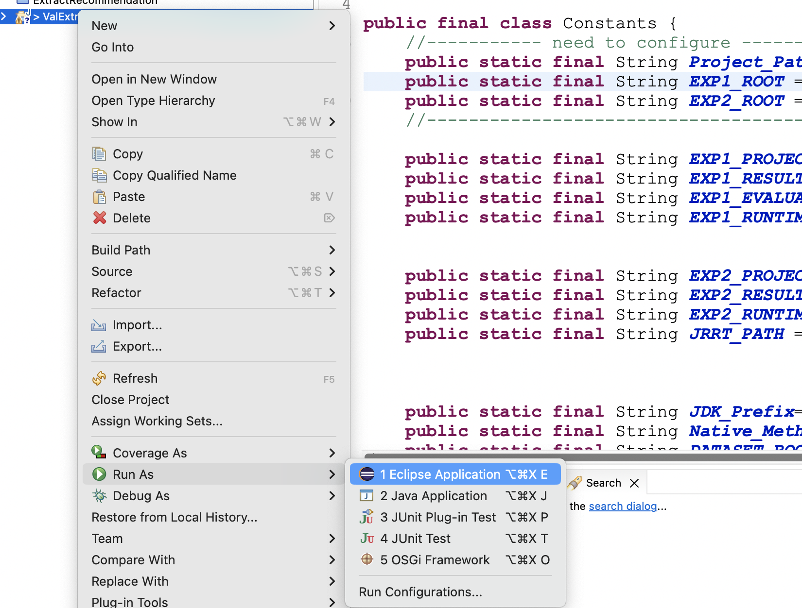
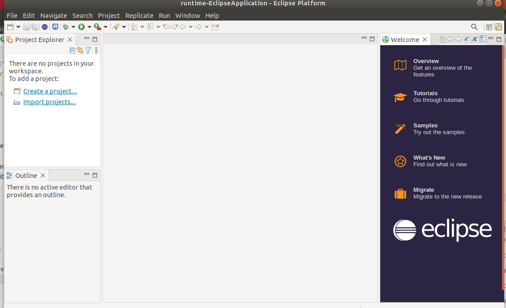
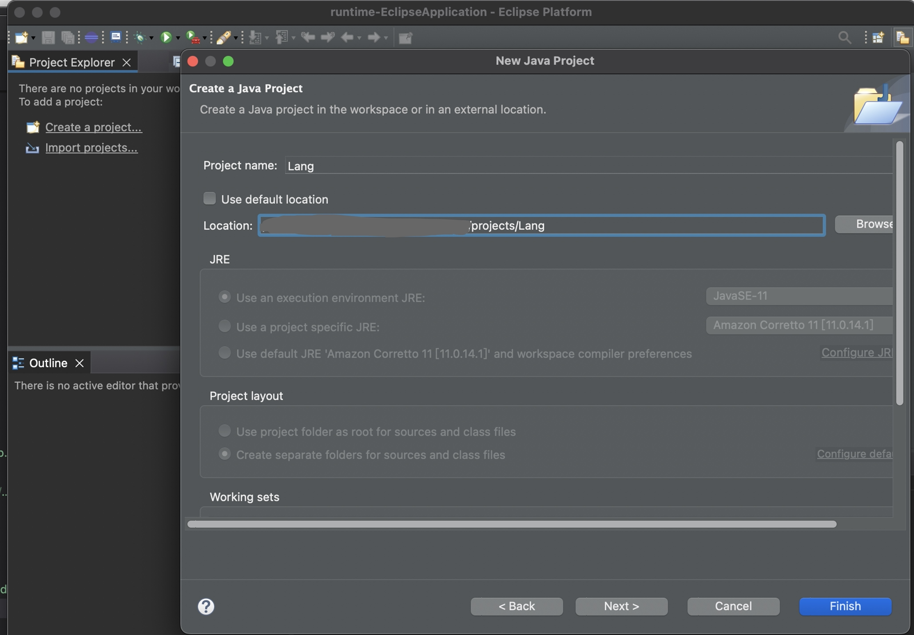
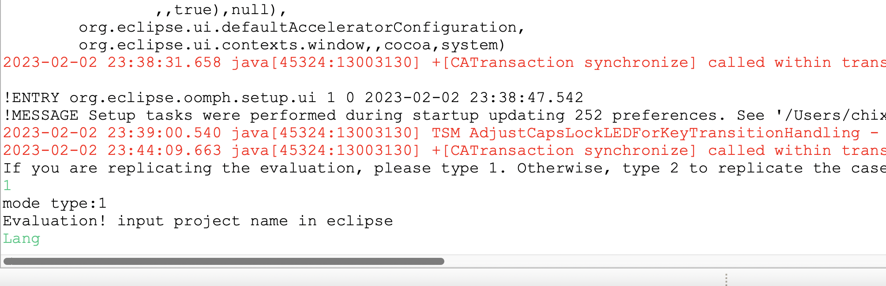
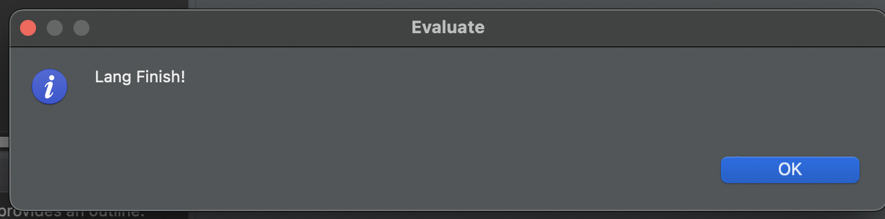

## Replication package for paper "Automated  Recommendation of Extracting Local Variable Refactorings"

# Table of Contents

- [General Introduction](#General-Introduction)
- [Contents of the Replication Package](#Contents-of-the-Replication-Package)
- [Requirements](#Requirements)
- [How to Replicate the Evaluation?](#How-to-Replicate-the-Evaluation)


# General Introduction

This is the replication package for TOSEM submission, containing both tools and data that are requested by the replication. It also provides detailed instructions to replicate the evaluation.

# Contents of the replication package

**/Implementation**: The implementation (in Java and Python) of the proposed approach. 

**/Evaluation**: Replication package for the evaluation section.


# Requirements
 - Java >=11
 - Git >= 1.9 
 - Eclipse IDE for Eclipse Committers(Older than 4.26.0)
 - Mac OS or Linux
 - [Defects4J](https://github.com/rjust/defects4j)
 <!-- - IntelliJ IDEA
 - [JRRT](https://code.google.com/archive/p/jrrt)
 - Junit4
 - Java 6 -->
  
# How to Replicate the Evaluation

## 1. Clone replication package to your local file system 

`git clone https://github.com/jiangyanjie/ValExtractorPlus.git`

## 2. Get Subject Applications

`./Implementation/shell/evaluation.sh`


## 3. Import replication package into Eclipse IDE for Eclipse Committers
 
Open Eclipse and import **Implementation/valExtractor+** into Workspace.

Click `File` ... `Import`, then selected `Existing projects into Workspace`

Select directory(path to **Implementation/valExtractorPlus**) as root and Click `Finish`


## 4. Configure Path

Open `Constrants.java`(Locate in `valextractor.utils` package) and modify `Project_Path`( **Path2Implementation/valExtractor**), `EXP1_ROOT`(the root path of the generated result in Case Study part) and `EXP2_ROOT`(the root path of the generated result in Evaluation part) 
```java
//----------- need to configure ----------- 
public static final String Project_Path="***/ValExtractorPlus/Implementation/ValExtractor/"; 
public static final String EXP2_ROOT = "***/ValExtractorPlus/Evaluation/"; 
//----------------------------------------- 
```	 
Note: please make sure all the paths end with `/`

## 5. Run as an Eclipse Application

Run ValExtractor as an Eclipse Application

<!--  

  -->

## 6. Reproduce Evaluation

We take project "Lang" as an example to show how to reproduce evaluation. The way to obtain `Lang` is to run the command:
```
defects4j checkout -p Lang -v 1f -w PATH2ValExtractorPlus/Evaluation/projects/Lang
```
Hint: all the projects evaluated for refactorings have the same bug number `1f`.

### 6.1 Import Test Project

Click `Create a project` or Open `File` ... `New` ... `Project`
Configure Project Location, Click `Finish`.

<!--   -->

### 6.2 Run the Plugin

Open `Replicate` and Click `Extract Variables` in menu.

<!--  -->

### 6.3 Manually Specify Replication of Evaluation

The evaluation and case study have different running models. In the evaluation part, we should try all repetitive expressions whereas in the case study we should only try such refactorings discovered from evolution history. To this end, you should let the tool known what you want to replicate and which test project you want to replicate. 

```shell
{If you are replicating the evaluation, please type 1. Otherwise, type 2 to replicate the case study}
1
mode type:1
Evaluation! input project name in eclipse
Lang
```
<!--  -->

### 6.4 Outputs of the Replication

After execution, the following window will pop up:



All the generated Result will be show as follows. 

`patch` folder generates three parts, the result of eclipse execution(`patch/Lang/eclipse`), the result of our approach execution(`patch/Lang/ours`), the result of the comparison(`patch/Lang/compare`), all of which are stored in the form of `patch`, all of which are stored in the form of `patch`. 

`runtime` folder contains the runtime of the eclipse/our approach for each refactoring in milliseconds.

`jrrt` folder generates the result of ours execution(`jrrt/Lang/ours`) with the setting of "Extracting Only Once" which are stored in the form of `java`. 

`Console` shows the comparison between JRRT and ours as following.

```shell
Lang total: 565
JRRT and Ours do: 426
JRRT does but Ours not does: 28
Ours does but JRRT not does: 94
JRRT and Ours not do: 17
```

Note1: all the files `*.xlsx` are obtained after we manually labeled the refactoring results of replication, rather than automatically generated.

Note2: the way to obtain all the files under `/patch/Lang/ours` and the way to obtain all the files under `/jrrt/Lang/JRRT` will be will be explained in [IDEA Instruction](Implementation/idea/README.md) and [JRRT Instruction](Implementation/jrrt/README.md) respectively.